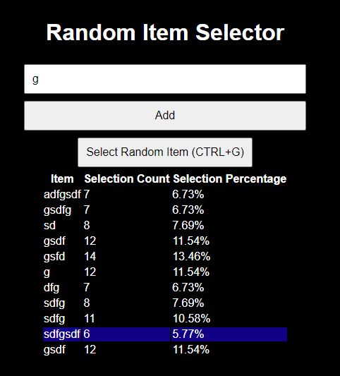

# Random Item Selector Web App

## Overview
This is a simple web application to pick from a list of values. It allows users to input items into a list and then select one at random. 

The web server runs on port 8080.

Note that there is no session management implemented, so refreshing the page will clear all entries.



## Features
- **Add Items**: Users can add items using a text input box.
- **Random Selection**: Click a button to highlight a random item from the list.

## Running with Docker

You can run the container this way:

```shell
docker run -p 8080:8080 inputobject2/random-picker
```

## API Usage

There are two ways to use this randomizer. The first is to go on the web page directly with a web browser, type in your items and hit random. Refresh the page to clear it out.

The second is with the API by sending a POST with a json body to `/random`, the API will return a random object from the list you sent.

```shell
curl -X POST http://localhost:8080/random -d '{"items":["apple", "banana", "cherry"]}' -H "Content-Type: application/json"
```

Server responds with:

```json
{
    "selectedItem":"banana"
}
```